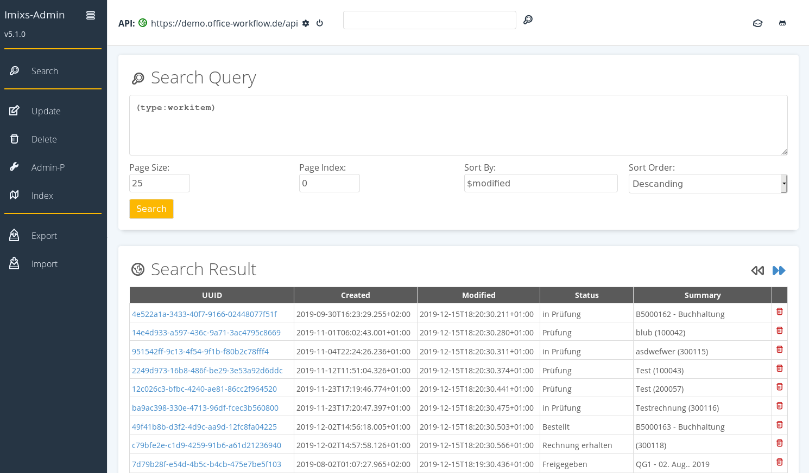
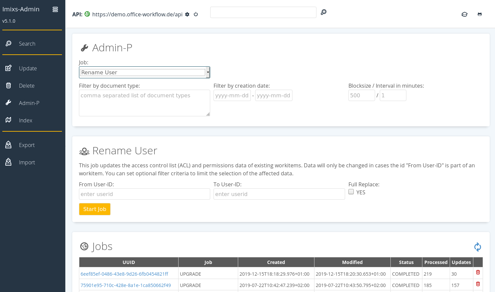

# Imixs-Admin

The Imixs-Admin project provides a web based tool to administrate an Imixs-Workflow instance.  
Imixs-Admin runs as a self-contained microservice with a modern Web UI based on ['Vue.js'](https://vuejs.org/). The client interacts with the Imxis-Workflow Engine via the Imixs-Rest API and the [Imixs-Melman library](https://github.com/imixs/imixs-melman). 

These are the core features of Imixs-Admin:

* Search documents using Lucene search queries
* Update or add properties to documents and process instances
* Process a set of workitems in a batch process
* Delete a set of documents manually or in batch 
* Start AdminP Jobs to rebuild the index or upgrade existing data
* Import and Export workflow data into the file system. 
 

  

The Imixs-Admin client provides a Docker Image to be used to run the service as a Docker container in a Docker-Swarm or Kubernetes environment. 
The docker image is available on [DockerHub](https://hub.docker.com/repository/docker/imixs/imixs-admin). 

You can start the latest version of the Imixs-Admin Tool in a docker container running:

	$ docker run -p 8888:8080 imixs/imixs-admin:latest

You can start the application from your browser

	http://localhost:8888/

## Build Imixs-Admin from sources

Alternatively you can build the imixs-admin client manually from sources and start from your local docker image:

	$ mvn clean install -Pdocker
	$ docker-compose up

### Changing the RootContext

The Imixs-Admin client is installed per default into the root context "/". You can change the root context by changing teh glassfish-web.xml file. The following example set the root-context to "/dev/": 

	<?xml version="1.0" encoding="UTF-8"?>
	<!DOCTYPE glassfish-web-app PUBLIC "-//GlassFish.org//DTD GlassFish Application Server 3.1 Servlet 3.0//EN"
	   "http://glassfish.org/dtds/glassfish-web-app_3_0-1.dtd">
	<glassfish-web-app>
		<context-root>/dev/</context-root>
	</glassfish-web-app>

## Development

Imixs-Admin is provided as a Maven Web Module and can be build by the maven command:

	$ mvn clean install

The .war file can be deployed into any Jakarta EE Application server.

### The Maven 'wildfly' Profile

During development you can use the docker-compose-dev.yml file. This stack contains a sample application and the Imixs-Admin tool. The deployment is  maped to the src/docker/deployments folder to the wildfly auto deploy directory. 

	$ mvn clean install -Pwildfly
	$ docker-compose -f docker-compose-dev.yml up
	
you may have to grant the deployment folder first to allow the docker non privileged user to access this location.

	$ sudo chmod 777 src/docker/deployments/

In this mode the deployment directory for wildfly is mapped to '~/git/imixs-admin/src/docker/deployments'

