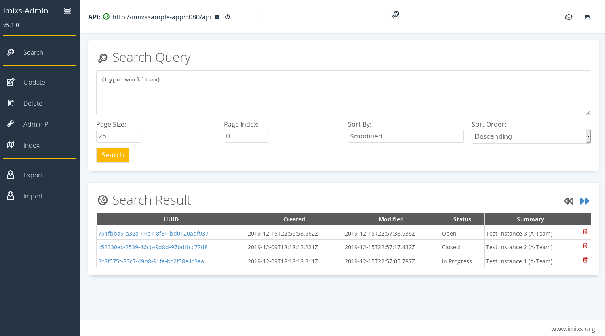

# Imixs-Admin

The Imixs-Admin project provides a web based administration tool to manage an [Imixs-Workflow](https://www.imixs.org) instance.  
Imixs-Admin connects to a running Imixs-Workflow instance via the Imixs-Rest API.

## Features

These are the core features of Imixs-Admin:

- Search documents using Lucene search queries or the Java Persistence Query Language (JPQL)
- Update or add properties to documents and process instances
- Process a set of workitems in a batch process
- Delete a set of documents manually or in batch
- Manage BPMN Models
- Start AdminP Jobs to rebuild the index or upgrade existing data
- Import and Export workflow data into the file system.

Learn more about the Imixs-Admin Tool on the [Imixs Workflow Project Site](https://www.imixs.org/doc/administration.html).

## Run with Docker

Imixs-Admin is based on Jakarta EE 10 and Wildfly Version 27.0.0. The project provides a Docker Image to be used to run the service in any Docker environment or in a Kubernetes cluster.
The docker image is available on [DockerHub](https://hub.docker.com/repository/docker/imixs/imixs-admin).

You can start the latest version of the Imixs-Admin Tool in a docker container running:

    $ docker run --rm --name="wildfly" -it \
    		-p 8080:8080 \
    		-e WILDFLY_PASS="adminadmin" \
    		imixs/wildfly

...and load the Imixs-Admin client from your browser

    http://localhost:8080/

### Insecure SSL Connections

The initialization of a secure JAX-RS / HTTPs connection from the Imixs-Admin client to a Imixs-Workflow instance can fail caused by the lack of a certificate in Java's keystore. A certificate import into the java keystore fixes the problem in most cases. But for development or for system tests, however, a certificate verification is not required and can be omitted. To accept insecure SSL connections the environment variable IMIXS_REST_CLIENT_INSECURE can be set to 'true':

    IMIXS_REST_CLIENT_INSECURE=true

In this mode, the Imixs-Rest Client will install a custom SSL TrustManager that accepts insecure SSL connections.

**Note:** This feature should only be used in dev and test environments!

## Build the Docker Image

To build the imixs-admin Docker image manually run:

    $ mvn clean install -Pdocker

To start it from your local docker environment:

    $ docker compose up

## Changing the RootContext

The Imixs-Admin client is installed per default into the root context "/". You can change the root context by changing teh glassfish-web.xml file. The following example set the root-context to "/dev/":

    <?xml version="1.0" encoding="UTF-8"?>
    <!DOCTYPE glassfish-web-app PUBLIC "-//GlassFish.org//DTD GlassFish Application Server 3.1 Servlet 3.0//EN"
       "http://glassfish.org/dtds/glassfish-web-app_3_0-1.dtd">
    <glassfish-web-app>
    	<context-root>/dev/</context-root>
    </glassfish-web-app>

## The Maven 'wildfly' Profile

During development you can use the docker-compose-dev.yml file. This stack contains a sample application and the Imixs-Admin tool. The deployment is maped to the docker/deployments folder to the wildfly auto deploy directory.

    $ mvn clean install -Pwildfly
    $ docker compose -f docker-compose-dev.yml up

you may have to grant the deployment folder first to allow the docker non privileged user to access this location.

    $ sudo chmod 777 docker/deployments/

In this mode the deployment directory for wildfly is mapped to '~/git/imixs-admin/src/docker/deployments'

To build the Docker image directly from the Dockerfile run:

    docker build --tag=imixs/wildfly .

# Development

Imixs-Admin provides a Docker-Compose stack for development including the Imixs-Process-Manager and a Postgres DB.
To start the stack run:

    $ docker compose -f docker-compose-dev.yaml up

you can Access the Admin Client via

    http://localhost:8080

and in a separate browser instance you can access the sample application:

    http://localhost:8081

To connect the Admin client to the sample application use the following internal host address:

    URL: http://imixs-sample-app:8080/api
    Authentication : Basic

## Build

In the Development mode, the deployment directory is maped to `imixs-admin/src/docker/deployments`, this is the wildfly auto deploy directory.
You may have to grant the deployment folder first to allow the docker non privileged user to access this location.

    $ sudo chmod 777 docker/deployments/

To build the imixs-admin client manually from sources run:

    $ mvn clean install

An auto deployment will be started using the Maven plugin [Manik Hot-Deploy](https://manik.imixs.org/).
The .war file can be deployed into any Jakarta EE Application server.

## Debug Mode

To build the imixs-admin client manually from sources with debug mode run the maven command:

    $ mvn clean install -Pdebug

This will build a Docker Image exposing the Wildfly Debug Port 8787.
